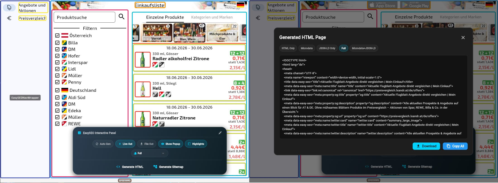
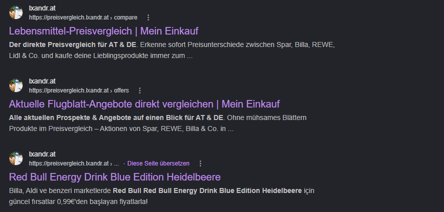

# flutter_easy_seo
⚖️ **License:** Free for solo developers & micro-startups. Teams of 6+ or organizations making greater than $1M revenue require a commercial tier. See [License Details](#%EF%B8%8F-license--commercial-usage).


### *“At this time, Flutter is not suitable for static websites with text-rich flow-based content... application output doesn't align with what search engines need to properly index.”*
— [**Official Flutter Documentation**](https://docs.flutter.dev/platform-integration/web/faq)

## **We fixed that.** 

`flutter_easy_seo` is a production-grade rendering engine that flattens your live Flutter widget tree into optimized, semantic, bot-readable HTML and metadata. By bridging your client-side application state with server-side delivery requirements, it gives you full control over how search engine crawlers index your dynamic canvas.

1. [**Initialize, Flag Views as Pages, and Expose Widgets**](#quick-start):
    - Use [**`EasySEOManager`**](#easyseomanager-singleton) within your `main()` function.
    - Use [**`EasySEOPage`**](#easyseopage) to wrap the root of your target view to flag it for HTML generation.
    - Use [**`EasySEOTextWrapper` / `.easySeoText()`**](#widget-wrappers--html-output) and other widgets (or their corresponding extension methods) on UI elements to expose them for SEO HTML generation.
2. [**Generate**](#generating-seo-friendly-html) HTML content, either interactively by clicking through your web app or automatically via a headless widget tester:
    1. [Interactive Mode](#interactive-mode)
    2. [Automated Mode via Widget Tester](#automated-mode-via-widget-tester)
3. [**Serve**](#serving-content-to-search-engine-bots) these static HTML pages to search engine bots while serving the Flutter app to human users.
4. [**See Web App Live in Action**](#examples-live) (Live Examples)

## Why `flutter_easy_seo`?

### The Problem

- **Search Bots Need Text**: For a web application to rank, search engine bots must parse the site's textual and structural content.
- **Flutter is a Blank Canvas**: To a crawler, a baseline Flutter Web app looks like an empty page. Flutter does not use a document-based HTML DOM; instead, it paints pixels directly onto a single, flat ``<canvas>`` via CanvasKit or WebAssembly. 
- **No SSR or Hydration**: Standard architectural workarounds like Server-Side Rendering (SSR) or DOM hydration are fundamentally impossible within Flutter's rendering pipeline.

### The Solution

This package implements a dual-layer strategy to bridge the Flutter-to-SEO gap completely:

1. **[Dynamic Rendering 🌐](https://developers.google.com/search/docs/crawling-indexing/javascript/dynamic-rendering) (Static File Serving)**: The package pre-generates your views into pure, static HTML files. When a search bot requests a page, your server instantly delivers this static file. Because it requires zero engine initialization, the bot gets the full text content instantly.
2. **Hybrid Live DOM Injection:** While the app runs for human users, the package actively injects the exact same semantic HTML directly into the browser DOM. 

   This serves as a critical fail-safe for two reasons:
   - **Anti-Cloaking Compliance:** Search engines like Google frequently run undercover audits using stealth, human-like user agents to verify that users see the same content as the bots. Live injection ensures your content remains identical across all testing profiles.
   - **Unknown Crawlers:** It provides a safe fallback for AI crawlers, scrapers, or third-party bots that do not announce themselves as a bot to your server, but still rely on reading a rendered HTML structure after execution.

#### Main features include:
- Complete SEO-friendly HTML documents from the live widget tree
- Automatic `sitemap.xml` generation
- SEO-relevant `<head>` tags and metadata (Twitter, Open Graph, custom meta tags)
- **Interactive Mode** with UI overlay for debugging and manual generation
- **Automated Mode** via Flutter Widget Tester for CI and scheduled generation
- JSON-LD structured data and Microdata support

## Installation

Add `flutter_easy_seo` to your `pubspec.yaml`:

```yaml
dependencies:
  flutter_easy_seo: ^1.0.0
```
or
```bash
flutter pub add flutter_easy_seo
```

## Quick Start

1. **Initialize** `EasySEOManager` within your `main()` function.
2. **Wrap** the root of your target view with `EasySEOPage` to flag it for HTML generation.
3. **Expose** content to the HTML body by wrapping your layout elements with semantic components 
like `EasySEOTextWrapper`, or by using their equivalent widget extension methods like `.easySeoText()`.

```dart
import 'package:flutter/material.dart';
import 'package:flutter/foundation.dart' show kDebugMode;
import 'package:flutter_easy_seo/flutter_easy_seo.dart';
import 'package:flutter_web_plugins/url_strategy.dart';

void main() {
   usePathUrlStrategy();
   WidgetsFlutterBinding.ensureInitialized();
   EasySEOManager.instance.init(
      enableInteractiveMode: kDebugMode,
      enableLiveOutput: kDebugMode,
      baseUrl: "https://mysite.com",
      pathProvider: // **REQUIRED when using router packages**
   );
   runApp(const MyApp());
}

class MyApp extends StatelessWidget {
   const MyApp({super.key});

   @override
   Widget build(BuildContext context) {
      return const MaterialApp(
         home: Scaffold(
            body: EasySEOPage(
               title: 'Some Web Page',
               child: SizedBox.expand(
                  child: Center(
                     child: EasySEOTextWrapper(child: Text('Hello World')),
                  ),
               ),
            ),
         ),
      );
   }
}
```

The example above generates:
```html
<!DOCTYPE html>
<html lang="de">
<head>
  <meta charset="UTF-8">
  <meta name="viewport" content="width=device-width, initial-scale=1.0">
  <title data-easy-seo="title">Some Web Page</title>
  <meta data-easy-seo="meta:name:title" name="title" content="Some Web Page">
  <link data-easy-seo="link:rel:canonical" rel="canonical" href="https://mysite.com/">
  <meta data-easy-seo="meta:property:og:title" property="og:title" content="Some Web Page">
  <meta data-easy-seo="meta:property:og:url" property="og:url" content="https://mysite.com/">
  <meta data-easy-seo="meta:name:twitter:card" name="twitter:card" content="summary_large_image">
  <meta data-easy-seo="meta:name:twitter:title" name="twitter:title" content="Some Web Page">
</head>
<body>
<p>Hello World</p>
</body>
</html>
```
```xml
<?xml version="1.0" encoding="UTF-8"?>
<urlset xmlns="http://www.sitemaps.org/schemas/sitemap/0.9"
        xmlns:xhtml="http://www.w3.org/1999/xhtml">
  <url>
    <loc>https://mysite.com/</loc>
    <priority>1.0</priority>
    <changefreq>daily</changefreq>
  </url>
</urlset>
```

## Configuration

The architecture consists of 4 main parts:
- **EasySEOManager:** Singleton for orchestration and configuration.
- **EasySEOPage:** Wraps (part of) a widget tree to generate an SEO-friendly HTML version.
- **Widget wrappers, HTML helpers, etc.:** Create specific HTML, JSON-LD and microdata output.
- **File generation:** Generate HTML and sitemap.xml files either interactively or automatically with a widget tester.


### EasySEOManager Singleton

Call `EasySEOManager.instance.init(...)` in your `main()` function to configure the global singleton:

| Parameter | Description |
|---|---|
| `enabled` | Globally controls whether SEO generation is active. |
| `enableFileOutput` | Writes generated HTML files to the local storage target. |
| `enableLiveOutput` | Injects the generated HTML into the live browser DOM. |
| `disableOnGenerate` | Disables the `onGenerate` callback. Set to `true` in automated widget tests to keep the app's `onGenerate` config unchanged. |
| `enableInteractiveMode` | Shows a widget overlay for debugging and interactive HTML generation. |
| `showResultDialog` | Whether a modal dialog is presented in interactive mode to preview the generated output. |
| `showHighlights` | When `true`, renders colored borders around widgets flagged for SEO tracking. |
| `renderMode` | The `SEORenderMode` — controls which output formats are generated (html+jsonld, html-only, microdata, etc.). |
| `onGenerate` | Callback invoked when an HTML page is generated (e.g. to stream the result to a REST endpoint). |
| `baseUrl` | The root domain URL for absolute canonical/alternate links. Falls back to the current browser URL on web. |
| `supportedLanguages` | Language codes for prefix-routing (e.g. `['en', 'de']`). The first entry is the default language. Used for `hreflang` alternate links and sitemap generation. |
| `pages` | Static and dynamic route patterns for the sitemap. Dynamic routes (e.g. `products/:id`) auto-collect matching URLs from generated HTML. |
| `headTags` | Global `<meta>`, `<link>`, and `<script>` tags injected into the document `<head>` on every page. |
| `pathProvider` | Delegate to retrieve the current active path. **Required** for GoRouter, auto_route, and Beamer — see [pathProvider section](#providing-a-pathprovider-for-declarative-routers). |

### EasySEOPage

Wrap the page content with `EasySEOPage` and provide at minimum a `title`:

| Parameter | Description |
|---|---|
| `child` | The widget tree of the page content to render and inspect. |
| `title` | The canonical page title — generates `<title>`, `og:title`, `twitter:title`, and `<meta name="title">`. |
| `description` | Optional page description — generates `description`, `og:description`, and `twitter:description` meta tags. |
| `disabled` | When `true`, disables SEO generation locally for this specific page. |
| `headTags` | Page-level `<head>` tags that override (rather than append to) global `headTags`. |
| `includeGlobals` | List of `EasySEOBaseWrapper.globalName` ids to include in the generated `<body>` even when they live outside this page's widget tree (e.g. header, footer, navigation in a `ShellRoute`). |
| `whenDone` | Async callback executed before HTML generation to ensure async state (e.g. Riverpod providers) is resolved. |
| `rank` | Numeric priority for disambiguating multiple `EasySEOPage` instances in the same tree (e.g. a list page with a detail dialog — set `rank: 1` on the dialog). |
| `renderMode` | Overrides the global `SEORenderMode` for this page only. |

### Providing a `pathProvider` for Declarative Routers

`EasySEOManager.getCurrentPath()` retrieves the resolved URL path to populate meta tags like `og:url`.
It resolves the path using a three-layer fallback chain:

1. **`pathProvider`** callback (explicitly configured) — highest priority.
2. **`ModalRoute.of(context)?.settings.name`** — fallback for Navigator 1.0 routers where `settings.name` stores the literal URL path (e.g., vanilla `MaterialApp`, `fluro`)
3. **Browser URL** via `URLHelper().getCurrentPath()` — web only (unavailable in widget testers).

#### Why Declarative Routers Need an Explicit `pathProvider`

Declarative routers like **GoRouter**, **auto_route**, and **Beamer** use `settings.name`
to store internal symbolic names or configuration keys rather than concrete runtime URL paths.

Without an explicit `pathProvider`, your generated `og:url` tags will fall back to internal route tokens (e.g., `HotelDetailRoute` or `hotel_details`) instead of the true browser path (e.g., `/de/hotels/2`).

To ensure accurate SEO tracking, configure the `pathProvider` in `EasySEOManager.instance.init` for your specific routing engine:

```dart
// GoRouter
pathProvider: (context) => GoRouter.maybeOf(context)?.routerDelegate.currentConfiguration.uri.toString(),
// auto_route
pathProvider: (context) => context.router.currentPath,
// Beamer
pathProvider: (context) => (Beamer.of(context).currentBeamLocation.state as BeamState).uri.toString(),
```

Note: Vanilla Navigator 1.0 requires no configuration; its `settings.name` natively mirrors the literal URL path.

## Widget Wrappers & HTML Output

Although both Flutter and HTML rely on a tree structure to define content, a Flutter widget tree cannot be converted into an HTML document entirely automatically. To generate optimized SEO metadata, we must explicitly flag specific parts of the widget tree. This architectural approach is necessary for several reasons:

1. **SEO-Focused Filtering:** We only want to extract content that directly impacts search engine indexing and discoverability.
2. **Structural Mismatches:** Many Flutter layout widgets lack a meaningful HTML equivalent. While structural components like `Center` or `Padding` are essential for a full visual CSS layout, they serve no purpose in an SEO-friendly, text-first HTML document.
3. **Contextual Layout Mapping:** A single Flutter widget can represent entirely different semantic HTML elements depending on its context. For example, a `Row` of images could map to a site `<header>` containing an `<h1>` and `<a>` tags, or it could simply translate to a standard `<div>` containing `` elements.

Note: For some Flutter widgets the HTML content can be automatically extracted:
- **`Text()`**: `easySeoP` and `easySeoH1..H6` automatically extract the text content
- **`Image.network, Image.asset`**: `easySeo` automatically extracts the `src`

### HTML + JSON-LD Examples

#### Text() or any Widget to `<p>, <h1> ... <h6>`
```dart
// Text() to <p> - default behaviour
EasySEOTextWrapper(child: Text('Hello World')) // or
Text('Hello World').easySeoText() // or
Text('Hello World').easySeoP()

// Text() to <h1> ... <h6>
EasySEOTextWrapper(
   textType: SEOTextType.h1, 
   child: Text('Main Topic')
) 
// or
Text('Sub Topic').easySeoText(textType: SEOTextType.h3) 
// or
Text('Least important Topic').easySeoH6()

// any widget to <p>, <h1> ... <h6>
FancyVisualHeader().easySeoH1(text: "Main Topic")
```
```html
<p>Hello World</p>
<h1>Main Topic</h1>
<h3>Sub Topic</h3>
<h6>Least important Topic</h6>
<h1>Main Topic</h1>
```

#### Image() to ``
```dart
Image.network('https://picsum.photos/seed/home/800/400').easySeo(alt: 'Net Image')
Image.asset('/images/asset.png').easySeo(alt: 'Asset Image')
```
```html


```

#### Widget() to `<header>`
```dart
ComplexAnimatedHeaderWidget().easySeoHeader(
 h1: "App Web Version",
 children: [
   SEOAnchor(href: "https://...", content: "AppStore"),
   SEOAnchor(href: "https://...", content: "PlayStore"),
 ]
);
```
```html
<header>
  <h1>App Web Version</h1>
  <a href="https://...">AppStore</a>
  <a href="https://...">PlayStore</a>
</header>
```

#### NavigationRail, NavigationBar or Widget to `<nav>`
```dart
NavigationRail( // or NavigationBar(...
  ...
  destinations: [
    NavigationRailDestination(
      ...
      label: Text("Item 1").easySeoNavAnchor(
        path: 'https://.../item1')
    ),
    NavigationRailDestination(
      ...
      label: Text("Item 2").easySeoNavAnchor(
        path: 'https://.../item2')
    ),
  ],
).easySeo(globalName: "main_navigation")
// or
Column(
  children: [
    TextButton(
      onPressed: () => { /* load page 1 */},
      child: Text("Item 1").easySeoNavAnchor(
        path: 'https://.../item1'
      ),
    ),
    TextButton(
      onPressed: () { /* load page 2 */ },
      child: Text("Item 2").easySeoNavAnchor(
        path: 'https://.../item2'
      ),
    )
  ]
).easySeoNav(globalName: "main_navigation");
```
```html
<nav>
  <ul>
    <li>
      <a href="https://.../item1">Item 1</a>
    </li>
    <li>
      <a href="https://.../item2">Item 2</a>
    </li>
  </ul>
</nav>
<script type="application/ld+json"> {
  "@context": "https://schema.org",
  "@type": "ItemList",
  "numberOfItems": 2,
  "itemListElement": [
    {
      "@type": "ListItem",
      "position": 1,
      "item": {
        "@type": "SiteNavigationElement",
        "name": "Item 1",
        "url": "https://.../item1"
      }
    }, 
    {
      "@type": "ListItem",
      "position": 2,
      "item": {
        "@type": "SiteNavigationElement",
        "name": "Item 2",
        "url": "https://.../item2"
      }
    }
  ]
}
</script>
```

#### Widget to breadcrumb `<nav>`
```dart
Row(
  children: [
    TextButton(
      onPressed: () => { /* load page 1 */},
      child: Text("Products").easySeoNavAnchor(
        path: 'https://.../products'
      ),
    ),
    TextButton(
      onPressed: () { /* load page 2 */ },
      child: Text("Groceries").easySeoNavAnchor(
        path: 'https://.../groceries'
      ),
    )
  ]
).easySeoNav(
  globalName: "breadcrumb_navigation", 
  isBreadcrumb: true
);
```
```html
<nav aria-label="Breadcrumb">
  <ol style="display: flex; list-style: none; padding: 0;">
    <li>
      <a href="https://.../products">Products</a>
    </li>
    <span aria-hidden="true" style="margin: 0 8px;">›</span>
    <li>
      <a href="https://.../products/groceries" aria-current="page">Groceries</a>
    </li>
  </ol>
</nav>
<script type="application/ld+json">{
  "@context":"https://schema.org",
  "@type":"BreadcrumbList",
  "itemListElement":[
    {
      "@type":"ListItem",
      "position":1,
      "name":"Products",
      "item":"https://.../products"
    },
    {
      "@type":"ListItem",
      "position":2,"name":
      "Groceries",
      "item":"https://.../products/groceries"
    }
  ]
}
</script>
```

#### Widget (e.g. 'ProductCardWidget') to `<article>` + 'Product' JSON-LD
```dart
// var product = ...
// var prices = ...
// var validFrom = ...
// var validTo = ...
ProductCardWidget().easySeoProduct(
  product.name, 
  headingBuilder: SEOH3.new, 
  children: [
    SEOBrand(product.brand.name),
    SEOSizeUnit("${product.size}", product.unit),
    SEOProductOffers(
      lowPrice: prices.first.price,
      highPrice: prices.last.price,
      offerCount: prices.length,
      individualOffers: prices.map((e) => {
        'price': e.price, 
        'seller': e.shop.name, 
        'availability': e.isAvailable}
      ).toList(),
      validFrom: validFrom,
      validThrough: validTo
    )
  ]
)
```
```html
<article>
  <h3 class="name">Water</h3>
  
  <p class="brand">
    <span class="name">Water Brand</span>
  </p>
  <p class="additionalProperty">
    <span class="name">weight</span>
    <span class="value">500</span>
    <span class="unitText">ml</span>
  </p>
  <div class="aggregateOffer">
    <span class="lowPrice">1.48</span>
    <span class="highPrice">1.68</span>
    <span class="offerCount">2</span>
    <span class="priceCurrency">EUR</span>
    <ul class="offers-list">
      <li class="offer-item">
        <span class="price">1.48</span>
        <span class="priceCurrency">EUR</span>
        <div class="seller">
          <span class="name">Shop 1</span>
        </div>
        <time class="validThrough" datetime="2026-06-17T00:00:00.000Z">17.06.2026</time>
        <time class="validFrom" datetime="2026-06-11T00:00:00.000Z">11.06.2026</time>
      </li>
      <li class="offer-item">
        <span class="price">1.68</span>
        <span class="priceCurrency">EUR</span>
        <div class="seller">
          <span class="name">Shop 2</span>
        </div>
        <time class="validThrough" datetime="2026-06-17T00:00:00.000Z">17.06.2026</time>
        <time class="validFrom" datetime="2026-06-11T00:00:00.000Z">11.06.2026</time>
      </li>
    </ul>
  </div>
</article>
<script type = "application/ld+json"> {
  "@context": "https://schema.org",
  "@type": "Product",
  "name": "Water",
  "image": ["https://water.webp"],
  "brand": {
    "@type": "Brand",
    "name": "Water Brand"
  },
  "additionalProperty": [{
      "@type": "PropertyValue",
      "name": "weight",
      "value": "500",
      "unitText": "ml"
    }
  ],
  "offers": {
    "@type": "AggregateOffer",
    "lowPrice": 1.48,
    "highPrice": 1.68,
    "offerCount": 2,
    "priceCurrency": "EUR",
    "offers": [{
        "@type": "Offer",
        "price": 1.48,
        "priceCurrency": "EUR",
        "itemCondition": "https://schema.org/NewCondition",
        "availability": "https://schema.org/InStock",
        "seller": {
          "@type": "Organization",
          "name": "Shop 1"
        },
        "validThrough": "2026-06-17T00:00:00.000Z",
        "validFrom": "2026-06-11T00:00:00.000Z"
      }, {
        "@type": "Offer",
        "price": 1.68,
        "priceCurrency": "EUR",
        "itemCondition": "https://schema.org/NewCondition",
        "availability": "https://schema.org/InStock",
        "seller": {
          "@type": "Organization",
          "name": "Shop 2"
        },
        "validThrough": "2026-06-17T00:00:00.000Z",
        "validFrom": "2026-06-11T00:00:00.000Z"
      }
    ]
  }
}
</script>
```

### Custom Output Generation

#### With core classes

At the core of this mapping system are the **SEOHtml** class and its derived elements, which allow you to define any custom HTML tree. While these are used automatically by our widget wrappers, you can also use them directly if the built-in extensions and helper methods don't fit your needs. For example, if the `EasySEOFaqWrapper` weren't available, you could build a custom FAQ structure like this:
```dart
Column(
  children: [
    Text('Frequently Asked Questions'),
    Text('Q1: How does this work?'),
    Text('A1: It generates HTML from the widget tree.'),
    Text('Q2: Is it fast?'),
    Text('A2: Yes, it runs asynchronously.'),
  ],
).easySeoHtml(children: [
  SEOSection(
    attributes: {'itemscope': null, 'itemtype': 'https://schema.org/FAQPage'},
    jsonLd: {
      '@type': 'FAQPage',
      'mainEntity': [
        {'@type': 'Question', 'name': 'How does this work?',
         'acceptedAnswer': {'@type': 'Answer', 'text': 'It generates HTML from the widget tree.'}},
        {'@type': 'Question', 'name': 'Is it fast?',
         'acceptedAnswer': {'@type': 'Answer', 'text': 'Yes, it runs asynchronously.'}},
      ],
    },
    children: [
      SEODiv(attributes: {'itemprop': 'mainEntity', 'itemscope': null, 'itemtype': 'https://schema.org/Question'},
        children: [
          SEOH3('How does this work?', attributes: {'itemprop': 'name'}),
          SEODiv(attributes: {'itemprop': 'acceptedAnswer', 'itemscope': null, 'itemtype': 'https://schema.org/Answer'},
            children: [
              SEOParagraph('It generates HTML from the widget tree.', attributes: {'itemprop': 'text'}),
            ]),
        ]),
    ]),
])
```
```html
<section class="faq-page">
  <div class="mainEntity">
    <h3 class="name">How does this work?</h3>
    <div class="acceptedAnswer">
      <p class="text">It generates HTML from the widget tree.</p>
    </div>
  </div>
</section>
<script type="application/ld+json">{
  "@context": "https://schema.org",
  "@type": "FAQPage",
  "mainEntity": [
    {
      "@type": "Question", 
      "name": "How does this work?", 
      "acceptedAnswer": {
        "@type": "Answer", 
        "text": "It generates HTML from the widget tree."
      }
    },
    {
      "@type": "Question", 
      "name": "Is it fast?", 
      "acceptedAnswer": {
        "@type": "Answer", 
        "text": "Yes, it runs asynchronously."
      }
    }
  ]
}</script>
```

#### With custom wrappers by extending `EasySEOBaseWrapper`

If none of the built-in wrappers fit your needs, you can create your own by extending `EasySEOBaseWrapper` and implementing `toSEOHtml()`. Return the semantic core only — the processor automatically layers on:

- **`className`** / **`attributes`** — merged onto the root tag's attributes
- **`jsonLd`** — applied only if your `toSEOHtml()` result doesn't already have its own
- **`children`** (additional tags) — heading tags sorted first, then non-heading tags last

```dart
class MyFooterWrapper extends EasySEOBaseWrapper {
  const MyFooterWrapper({
    super.key,
    required super.child,
    super.className,
    super.attributes,
    super.globalName,
    super.children,
  });

  @override
  SEOHtml toSEOHtml({
    required List<SEOHtml> children,
    required List<SEONavItem> navItems,
    required BuildContext context,
  }) {
    return SEOHtml(
      tag: 'footer',
      children: children,
      jsonLd: {'@type': 'WPFooter'},
    );
  }
}
```

Usage:
```dart
MyFooterWrapper(
  className: 'site-footer',
  child: Column(children: [
    Text('© 2026 MyCorp').easySeoP(),
  ]),
)
```

This produces:
```html
<footer class="site-footer">
  <p>© 2026 MyCorp</p>
</footer>
<script type="application/ld+json">{"@context":"https://schema.org","@type":"WPFooter"}</script>
```

## Generating SEO-Friendly HTML

The generation of SEO-friendly versions of the Flutter web application can be accomplished in two different ways:
1. **Interactive Mode:** Utilizes a UI overlay for real-time visualization and control.
2. [**Automated Mode:**](#automated-mode-via-widget-tester) Executes programmatically via the Flutter widget tester.

### Interactive Mode

Interactive mode serves two primary purposes:
1. **Debugging:** It allows you to inspect the specific HTML content generated for each page and test different output formats (e.g., HTML only, HTML + JSON-LD, or Microdata). It also provides visual debugging by rendering colored borders around the widgets currently flagged for SEO tracking based on their wrapper type.
2. **HTML Generation:** As you navigate through the web application, you can dynamically capture the generated content. The package supports automatically downloading the output as a file, downloading on demand, copying it to the clipboard, or streaming it directly to a backend REST endpoint via the `EasySEOManager.onGenerate` callback.



### Automated Mode via Widget Tester

While Interactive Mode is ideal for manual verification and rapid debugging, it is impractical for large-scale production applications with high-cardinality routing, such as an e-commerce platform with hundreds of product detail pages. For these use cases, an automated, headless pipeline is required.

Leveraging the `WidgetTester` framework allows for fully automated, headless HTML generation. Although programmatic widget testing in Flutter introduces specific synchronization challenges, the `flutter_easy_seo` package provides structural primitives and helpers to streamline the implementation.

When engineering an automated generation script, several critical architectural edge cases must be managed:
- [**Asynchronous Content Settlement:**](#asynchronous-content-settlement) Before executing the HTML generation lifecycle, the `WidgetTester` must yield until the UI is fully settled. This requires waiting not only for asynchronous network operations (e.g., fetching product data from a database) but also for reactive localization changes to complete without triggering a full page reload.

- [**Dynamic Route Discovery:**](#dynamic-route-discovery) In data-driven applications, valid deep links are often unknown at compile time. If a catalog page dynamically renders links to individual product details, the framework must discover these targets at runtime. The flutter_easy_seo package addresses this by parsing the generated output, automatically collecting discovered URLs that match the dynamic routing patterns registered in `EasySEOManager.pages`.

- [**Asynchronous Context Execution:**](#asynchronous-context-execution) By default, the Flutter `WidgetTester` environment executes within a simulated, synchronous clock domain via the `FakeAsync` zone. Side effects that rely on real-world time or external I/O—such as streaming the generated HTML payloads to a remote REST endpoint—must be explicitly wrapped in `tester.runAsync()` to prevent deadlock or test failure.

- [**Headless Environment Limitations & Mocking:**](#headless-environment-limitations--mocking) Because the headless test runner does not execute within a true browser context, certain web-specific APIs are unavailable. For example, browser-native URL retrieval hooks fail and must be injected via alternate configuration methods. Furthermore, dependencies that use platform-specific guards can cause runtime exceptions; while code may use `if (!kIsWeb)` to guard a mobile package like path_provider, `kIsWeb` evaluates to `false` in a standard command-line test environment. Consequently, these platform-dependent packages must be explicitly mocked.

#### Asynchronous Content Settlement

The most critical factor when generating SEO-friendly HTML content is ensuring the page has fully loaded. A standard `tester.pumpAndSettle()` is often insufficient when a page fetches asynchronous data (e.g., from a Riverpod database provider) or dynamically updates its locale state.

To solve this, the `flutter_easy_seo` package provides a robust synchronization utility: 
```dart
Future<void> waitForRoute(
  String route,
  WidgetTester tester, {
    bool Function()? extraCheck,
    Duration timeout = const Duration(seconds: 5),
  })
```
This function temporarily bypasses the synchronous `FakeAsync` testing zone to allow real-world asynchronous operations to complete, performing the following checks:

- **Route Discovery:** It blocks until a widget matching `ValueKey(route)` is found in the element tree. By wrapping your page with `EasySEOPage(key: ValueKey(route))`, the tester will reliably wait for that specific page to mount.

- **Callback Resolution (`EasySEOPage.whenDone`)** It awaits the resolution of the page's asynchronous initialization block. This is ideal for pausing execution until data hooks resolve, such as: `() async => await ref.read(productsCompareProvider.future)`.

- **Custom Guard Verification (`extraCheck`):** Even after the route mounts and the data resolves, race conditions can still occur. For example, during a dynamic language switch (e.g., `/de/prices` to `/en/prices`), the route structure matches immediately, but localized text assets may take an extra frame to propagate. Pass an extraCheck callback to verify that the rendered UI elements align perfectly with your underlying localization state before taking the snapshot.

#### Dynamic Route Discovery

When data is loaded dynamically from a database, a web application will typically utilize dynamic routing. For example, a product overview page may link to individual product detail pages where a unique product ID forms part of the URL path. You can define these dynamic paths within `flutter_easy_seo` as follows:
```dart
EasySEOManager.instance.init(
  //...
  supportedLanguages: ['de', 'en'], // auto generate link meta tags and sitemap.xml
  pages: ['/', 'products', 'products/:productId'], // auto generate sitemap.xml
  //...
);
```
Every link generated on the `products` page is collected automatically if it matches the dynamic pattern defined by `products/:productId`. These discovered paths are exposed as a `Set` by the EasySEOManager and can be processed sequentially during your snapshot loop (after processing the static routes):
```dart
// ... code that visits static routes ...
// followed by code that visits dynamic routes
var gatheredRoutes = EasySEOManager.instance.getAllRoutes(gatheredOnly: true);
for (final route in gatheredRoutes) {
  await visitRouteAndGenerate(route, router, tester, container);
}
```

#### Asynchronous Context Execution

When the widget tester requires real-world operations to complete—such as asynchronous data loading—the following utility function can be used. This underpins the implementation of the `waitForRoute` method described above.
```dart
Future<void> waitUntilReady(
  WidgetTester tester,
  bool Function() condition, {
    Duration timeout = const Duration(seconds: 5),
  })
```

#### Headless Environment Limitations & Mocking

Certain browser dependencies and platform capabilities used in a Flutter web application are unavailable in a headless widget testing environment. To address this, the `flutter_easy_seo` package provides out-of-the-box mocks and sensible environmental defaults.

Use this wrapper function to initialize your test definitions instead of the standard `testWidgets`:
```dart
void testSeoWidgets(
  String description,
  Future<void> Function(WidgetTester tester) callback, {
    bool skip = false,
    Timeout? timeout,
  })
```
By default, this wrapper configures the testing environment to:
- Mock the `path_provider` storage target to the local directory ('.').
- Mock the `connectivity_plus` status to a constant 'wifi' state.
- Initialize an empty, functional `shared_preferences` storage block.
- Suppress visual overflow errors from failing the build pipeline.
- Configure a fixed, standard desktop viewport resolution of 1920x1080.
- Enforce automated cleanup to prevent orphan cache files in your workspace.

Additionally, this convenience method simulates the browser opening with a specific `initialRoute` already loaded in the address bar prior to building the widget tree:
```dart
void setRouteBeforePumpWidget(WidgetTester tester, String initialRoute)
```

## Serving Content to Search Engine Bots

The final link in the architecture chain is serving your generated, SEO-friendly HTML files to search engine crawlers. This process consists of two primary operational phases:

### 1. HTML Snapshot Storage Strategies

Depending on your infrastructure setup, you can persist the generated HTML files in any directory accessible to your web server. 

* **Static Embeds (Small Sites):** For small or static websites where content updates are infrequent, snapshots can be placed directly into Flutter's `web/` folder directory. They will then be included in standard build and deployment workflows.
* **Dynamic Pipeline Delivery (Large Sites / Web Shops):** For larger sites or e-commerce platforms with frequently changing database records, triggering a complete deployment for every content update is highly impractical. For this scenario, a decoupled automation workflow is recommended:

    ```mermaid
    graph LR
        A["Interactive Mode or<br>Widget Tester"] -->|Sends generated HTML| B("Server REST Endpoint")
        B -->|Writes Static Output| C[("Web Folder / Storage")]

        style A fill:#1351B4,stroke:#fff,stroke-width:2px,color:#fff
        style B fill:#008060,stroke:#fff,stroke-width:2px,color:#fff
        style C fill:#4A5568,stroke:#fff,stroke-width:2px,color:#fff
    ```

    Regardless of the pipeline strategy you choose, the output generation engine must produce a clean directory tree mapping an `index.html` file to every unique URL path in your application:

    ```text
    seo_snapshots/
    ├── de
    │   ├── products
    │   │   ├── 1
    │   │   │   └── index.html
    │   │   ├── 10071
    │   │   │   └── index.html
    │   │   └── index.html
    │   └── index.html
    ├── en
    │   ├── products
    │   │   ├── 1
    │   │   │   └── index.html
    │   │   ├── 10071
    │   │   │   └── index.html
    │   │   └── index.html
    │   └── index.html
    └── index.html
    ```

### 2. User-Agent Request Routing

Next, you must configure your production web server to transparently intercept web spiders and serve these static HTML files while leaving human users unaffected. 

When deploying to an **Apache-2.0** environment, you can implement this conditional reverse-proxy logic directly inside your `.htaccess` file:
```apache
<IfModule mod_rewrite.c>
  RewriteEngine On
  RewriteBase /

  # ============================================================
  # SECTION 1: BOT DETECTION & SEO SNAPSHOT SERVING
  # ============================================================
  
  # 1. Inspect the incoming User-Agent string to match known search spiders
  RewriteCond %{HTTP_USER_AGENT} (googlebot|google-inspectiontool|chrome-lighthouse|lighthouse|gptbot|oai-searchbot|claudebot|perplexitybot|applebot-extended|bytespider|amazonbot|placid|guzzle|bingbot|yandex|baiduspider|facebookexternalhit|twitterbot|rogerbot|linkedinbot|embedly|quora\ link\ preview|showyoubot|outbrain|pinterest\/0\.|pinterestbot|slackbot|telegrambot|vkShare|W3C_Validator) [NC]

  # 2. Verify that a pre-rendered static snapshot exists for the requested path
  RewriteCond %{DOCUMENT_ROOT}/seo_snapshots%{REQUEST_URI}/index.html -f

  # 3. Serve the static snapshot rewrite and terminate processing [L]
  # Enforce the text/html content-type so crawlers do not download the asset as a file download.
  RewriteRule ^(.*)$ /seo_snapshots/$1/index.html [L,T=text/html]

  # ============================================================
  # SECTION 2: HUMAN NAVIGATION & FLUTTER ROUTING
  # ============================================================
  # (Your standard Flutter web routing rules continue here...)
</IfModule>
```
## Examples (Live)

### Package `/example` 

The example project of the `flutter_easy_seo` package is available as a live web app with Interactive Mode enabled. It is a fairly complex example that also demonstrates the capabilities and setup (e.g `.htaccess`) of the full pipeline using the `flutter_easy_seo` package. Read the [./example/README.md](./example/README.md) for a thorough description.

This example features a mocked hotel reservation web app that demonstrates several key features of the `flutter_easy_seo` package in action:
- **EasySEOPages:** Showcases a Landing Page, a Hotels List Page, and a Hotel Details Popup Dialog—demonstrating how a popup can be seamlessly turned into a dedicated, SEO-friendly HTML page.
- **Semantic Wrappers:** Highlights how to wrap widgets to generate SEO-relevant output for headers, main sections, footers, navigation, breadcrumbs, FAQs, and lists, alongside structured JSON-LD data (e.g., Hotel Details complete with Guest Reviews).
- **Live DOM Injection:** While the app runs for human users, the package actively injects the exact same semantic HTML directly into the browser DOM.
- **Interactive Mode:** Allows you to preview and download generated SEO HTML content, providing a visual presentation of the page elements currently flagged for SEO output using distinct colored borders.
- **Locale Support:** Native support for locales within the route structure, which are automatically factored into the `sitemap.xml` file generation.
- **Dynamic Routes:** Automatically detects any anchor URL in generated pages that matches a configured dynamic route pattern, dynamically appending it to the `sitemap.xml`.

These are the direct links to the demo pages:
- Landing Page (`https://fluttereasyseo.lxandr.at/example/en`):
    - <a href="https://fluttereasyseo.lxandr.at/example/en" target="_blank" rel="noopener noreferrer">User Version 🌐</a>/ <a href="https://fluttereasyseo.lxandr.at/example/en?bot=1" target="_blank" rel="noopener noreferrer">SEO Version 🌐</a>
- Hotels Overview Page (`https://fluttereasyseo.lxandr.at/example/en/hotels`):
    - <a href="https://fluttereasyseo.lxandr.at/example/en/hotels" target="_blank" rel="noopener noreferrer">User Version 🌐</a>/ <a href="https://fluttereasyseo.lxandr.at/example/en/hotels?bot=1" target="_blank" rel="noopener noreferrer">SEO Version 🌐</a>
- Hotels Details Page (`https://fluttereasyseo.lxandr.at/example/en/hotels/2`):
    - <a href="https://fluttereasyseo.lxandr.at/example/en/hotels/2" target="_blank" rel="noopener noreferrer">User Version 🌐</a>/ <a href="https://fluttereasyseo.lxandr.at/example/en/hotels/2?bot=1" target="_blank" rel="noopener noreferrer">SEO Version 🌐</a>

- The visually unappealing SEO versions will be indexed, whereas the flutter web app will not:

    

### Real World Example

Besides the `/example` of the package, you can also take a look at a real world example that uses the`flutter_easy_seo`:<br> 
- Landing Page (`https://preisvergleich.lxandr.at/en`):
    - <a href="https://preisvergleich.lxandr.at/en" target="_blank" rel="noopener noreferrer">User Version 🌐</a>/ <a href="https://preisvergleich.lxandr.at/en?bot=1" target="_blank" rel="noopener noreferrer">SEO Version 🌐</a>
- Product Price Compare Page (`https://preisvergleich.lxandr.at/en/compare`):
    - <a href="https://preisvergleich.lxandr.at/en/compare" target="_blank" rel="noopener noreferrer">User Version 🌐</a>/ <a href="https://preisvergleich.lxandr.at/en/compare?bot=1" target="_blank" rel="noopener noreferrer">SEO Version 🌐</a>
- Product Price Compare Details Page (`https://preisvergleich.lxandr.at/en/compare/1`):
    - <a href="https://preisvergleich.lxandr.at/en/compare/1" target="_blank" rel="noopener noreferrer">User Version 🌐</a>/ <a href="https://preisvergleich.lxandr.at/en/compare/1?bot=1" target="_blank" rel="noopener noreferrer">SEO Version 🌐</a>

- The visually unappealing SEO versions will be indexed, whereas the visually pleasing flutter web app will not:

    

## ⚖️ License & Commercial Usage

This package is distributed under a custom **Source-Available Small Business License**. 

* **Indie Devs & Micro-Startups (5 or fewer people AND less than $1M revenue):** 🟢 **100% FREE** for unlimited projects.
* **Growing Studios & Enterprises:** 🔴 A commercial license is required. 

👉 **!! COMING SOON !!** [**Get a Commercial License instantly on Polar**][polar-checkout]

### Available Tiers:
* 💼 **Studio Tier (€79)** — For teams of **6 to 15 people** (unlimited projects).
* 🚀 **Enterprise Tier (€249)** — For teams of **16+ people OR organizations making greater than $1M annual revenue** (unlimited projects).

*Both tiers grant instant, automated access to your unique license key (`FEZSEO-...`) and legal waiver clearance via Polar.*

*For full legal terms, see the [LICENSE](./LICENSE) file.*

[polar-checkout]: 