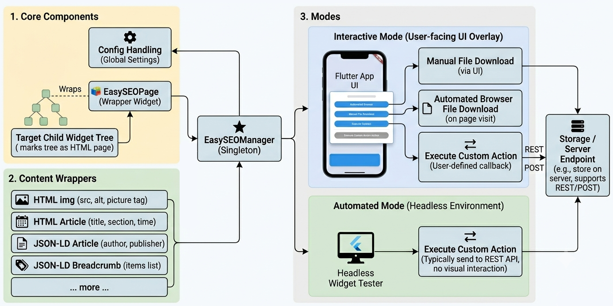

# flutter_easy_seo

A Flutter package that generates SEO-friendly HTML from the live widget tree for search engine bots.

## The Problem

- **Search Bots Need Text**: For a web application to rank, search engine bots must parse the site's textual and structural content.
- **Flutter is a Blank Canvas**: To a crawler, a baseline Flutter Web app looks like an empty page. Flutter does not use a document-based HTML DOM; instead, it paints pixels directly onto a single, flat ``<canvas>`` via CanvasKit or WebAssembly. 
- **No SSR or Hydration**: Standard architectural workarounds like Server-Side Rendering (SSR) or DOM hydration are fundamentally impossible within Flutter’s rendering pipeline.

## The Solution
This package implements a dual-layer strategy to bridge the Flutter-to-SEO gap completely:

1. **[Dynamic Rendering](https://developers.google.com/search/docs/crawling-indexing/javascript/dynamic-rendering) (Static File Serving)**: The package pre-generates your views into pure, static HTML files. When a search bot requests a page, your server instantly delivers this static file. Because it requires zero engine initialization, the bot gets the full text content instantly.
2. **Hybrid Live DOM Injection:** While the app runs for human users, the package actively injects the exact same semantic HTML directly into the browser DOM. 

   This serves as a critical fail-safe for two reasons:
   - **Anti-Cloaking Compliance:** Search engines like Google frequently run undercover audits using stealth, human-like user agents to verify that users see the same content as the bots. Live injection ensures your content remains identical across all testing profiles.
   - **Unknown Crawlers:** It provides a safe fallback for AI crawlers, scrapers, or third-party bots that do not announce themselves as a bot to your server, but still rely on reading a rendered HTML structure after execution.

## Main Features

- Generate complete HTML documents from the Flutter live widget tree
- Automatic sitemap.xml generation
- Supports SEO-relevant html tags and head section info and meta data (Twitter, Open Graph) and custom meta tags
- Interactive mode with UI overlay
- Automatic mode via flutter widget tester
- json+ld and microdata support

## Installation

Add `flutter_easy_seo` to your `pubspec.yaml`:

```yaml
dependencies:
  flutter_easy_seo: ^0.0.1
```

## Architecture Overview
The architecture consists of 4 main parts:
- **EasySEOManger:** Singleton for orchestration and configuration.
- **EasySEOPage:** Wraps (part of) a widget tree to genearate an SEO-friendly html version.
- **Widget wrappers, HTML helper, etc.:** Create specific HMTL, jsonld and microdata output.
- **File generation:** Generate HTML and sitemap.xml files either interactively or automatically with a widget tester.



## Simple Usage Example

1. **Initialize** `EasySEOManager` within your `main()` function.
2. **Wrap** the root of your target view with `EasySEOPage` to flag it for HTML generation.
3. **Expose** content to the HTML body by wrapping your layout elements with semantic components 
like `EasySEOTextWrapper`, or by using their equivalent widget extension methods like `.easySeoText()`.

```dart
import 'package:flutter/material.dart';
import 'package:flutter/foundation.dart' show kDebugMode;
import 'package:flutter_easy_seo/flutter_easy_seo.dart';
import 'package:flutter_web_plugins/flutter_web_plugins.dart';

void main() {
   usePathUrlStrategy();
   WidgetsFlutterBinding.ensureInitialized();
   EasySEOManager.instance.init(
      enableInteractiveMode: kDebugMode, // enable interactive mode in debug mode
      enableLiveOutput: kDebugMode, // inject to DOM in debug mode
      baseUrl: "https://mysite.com",
   );
   runApp(const MyApp());
}

class MyApp extends StatelessWidget {
   const MyApp({super.key});

   @override
   Widget build(BuildContext context) {
      return const MaterialApp(
         home: Scaffold(
            body: EasySEOPage(
               title: 'Some Web Page',
               child: SizedBox.expand(
                  child: Center(
                     child: EasySEOTextWrapper(child: Text('Hello World')),
                  ),
               ),
            ),
         ),
      );
   }
}
```
This will generate the following HMTL and sitemap.xml:
```html
<!DOCTYPE html>
<html lang="de">
<head>
  <meta charset="UTF-8">
  <meta name="viewport" content="width=device-width, initial-scale=1.0">
  <title data-easy-seo="title">Some Web Page</title>
  <meta data-easy-seo="meta:name:title" name="title" content="Some Web Page">
  <link data-easy-seo="link:rel:canonical" rel="canonical" href="https://mysite.com/">
  <meta data-easy-seo="meta:property:og:title" property="og:title" content="Some Web Page">
  <meta data-easy-seo="meta:property:og:url" property="og:url" content="https://mysite.com/">
  <meta data-easy-seo="meta:name:twitter:card" name="twitter:card" content="summary_large_image">
  <meta data-easy-seo="meta:name:twitter:title" name="twitter:title" content="Some Web Page">
</head>
<body>
<p>Hello World</p>
</body>
</html>
```
```xml
<?xml version="1.0" encoding="UTF-8"?>
<urlset xmlns="http://www.sitemaps.org/schemas/sitemap/0.9"
        xmlns:xhtml="http://www.w3.org/1999/xhtml">
  <url>
    <loc>https://mysite.com/</loc>
    <priority>1.0</priority>
    <changefreq>daily</changefreq>
  </url>
</urlset>
```

## Widget wrappers and HTML output
Although both Flutter and HTML rely on a tree structure to define content, a Flutter widget tree cannot be converted into an HTML document entirely automatically. To generate optimized SEO metadata, we must explicitly flag specific parts of the widget tree. This architectural approach is necessary for several reasons:

1. **SEO-Focused Filtering:** We only want to extract content that directly impacts search engine indexing and discoverability.
2. **Structural Mismatches:** Many Flutter layout widgets lack a meaningful HTML equivalent. While structural components like `Center` or `Padding` are essential for a full visual CSS layout, they serve no purpose in an SEO-friendly, text-first HTML document.
3. **Contextual Layout Mapping:** A single Flutter widget can represent entirely different semantic HTML elements depending on its context. For example, a `Row` of images could map to a site `<header>` containing an `<h1>` and `<a>` tags, or it could simply translate to a standard `<div>` containing `` elements.

<div style="display: flex; gap: 20px;">
  <div style="flex: 1;">

### Widget Wrapper
```dart
// Text() to <p> - default behaviour
EasySEOTextWrapper(child: Text('Hello World')) // or
Text('Hello World').easySeoText() // or
Text('Hello World').easySeoP()

// Text() to <h1> ... <h6>
EasySEOTextWrapper(
   textType: SEOTextType.h1, 
   child: Text('Main Topic')
) 
// or
Text('Sub Topic').easySeoText(textType: SEOTextType.h3) 
// or
Text('Least important Topic').easySeoH6()

// any widget to <p>, <h1> ... <h6>
FancyVisualHeader().easySeoH1(text: "Main Topic")
```
---
```dart
ComplexAnimatedHeaderWidget().easySeoHeader(
 h1: "App Web Version",
 additionalTags: [
   SEOHtml.a(href: "https://...", content: "AppStore"),
   SEOHtml.a(href: "https://...", content: "PlayStore"),
 ]
);
```

---
This is a new row directly under the first block in the left column.

  </div>
  <div style="flex: 1;">
    
### HTML Output
```html

<p>Hello World</p>


<h1>Main Topic</h1>


<h3>Sub Topic</h3>

<h6>Least important Topic</h6>


<h1>Main Topic</h1>
```
---
```html
<header>
  <h1>App Web Version</h1>
  <a href="https://...">AppStore</a>
  <a href="https://...">PlayStore</a>
</header>


```

---
This is a new row directly under the first block in the right column.

  </div>
</div>

### Widget SEO Extensions

Add SEO to individual widgets:

```dart
// Text widgets
Text('Page Heading').seo(tag: 'h1');
Text('Paragraph text').seo(tag: 'p');

// Container widgets
Container(
  child: Text('Section content'),
).seo(tag: 'section');

// Custom widgets
ProductGridWidget().seo(
  builder: (context, child) {
    return SEOContainerWrapper(
      tag: 'section',
      child: child,
    );
  }
);
```

## Output

The package generates:
- Complete HTML files for each route
- `sitemap.xml` with all page URLs
- Directory structure matching your site routes

## License

MIT License